buraya # ✦ Sürpriz Duvarı (AniDefteri)

> Sevdiklerinizin en özel anlarını ölümsüzleştirebileceğiniz, rol tabanlı, Google OAuth güvenlikli ve oyunlaştırılmış dinamik bir dijital zaman kapsülü uygulaması!

Sıradan kutlama mesajlarını ve 24 saat içinde kaybolup giden sosyal medya story'lerini geride bırakın. **Sürpriz Duvarı**, doğum günlerinden mezuniyetlere, kariyer başarılarından romantik yıldönümlerine kadar her dönüm noktasına özel tasarlanmış temalarla dijital anı duvarları oluşturmanızı ve arkadaşlarınızla ortaklaşa anılar/sorular biriktirmenizi sağlar.

---

## 📸 Adım Adım Kullanıcı Deneyimi & Ekran Akışı

### 1. 🚀 Giriş & Tanıtım Ekranı (Welcome Screen)
Kullanıcıları karşılayan, konseptlerin ve sistemin amacının anlatıldığı, hızlı işlem kartlarının yer aldığı modern karşılama alanı.
<p align="center">
  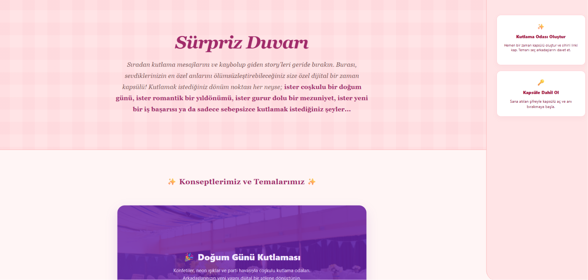
</p>

---

## 🛠️ BÖLÜM I: YÖNETİCİ DENEYİMİ (Odayı Kuran Kişi)

### A) Kapsül Oluşturma Formu (Create Wall - Adım 1)
Yöneticinin başlığı belirlediği, hedef kişinin e-postasını girdiği ve görsel temayı seçtiği alan. Metinler tamamen kişisel olarak ayarlanabilir.
<p align="center">
  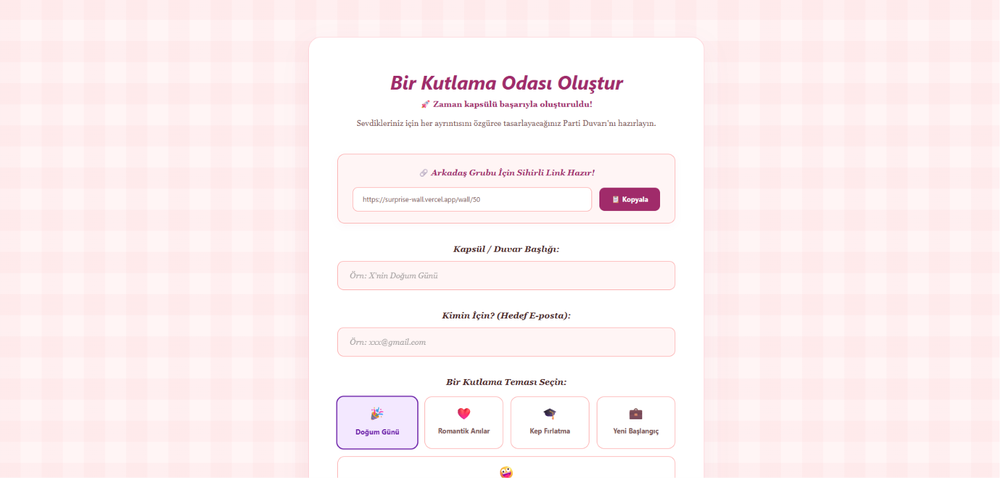
</p>

### B) Zaman ve Güvenli Çember Ayarları (Create Wall - Adım 2)
Geri sayım sayacının kurulduğu, sadece belirli kişilerin erişebilmesi için davetli e-postalarının (Güvenli Çember) eklendiği ve sihirli linkin alındığı alan.
<p align="center">
  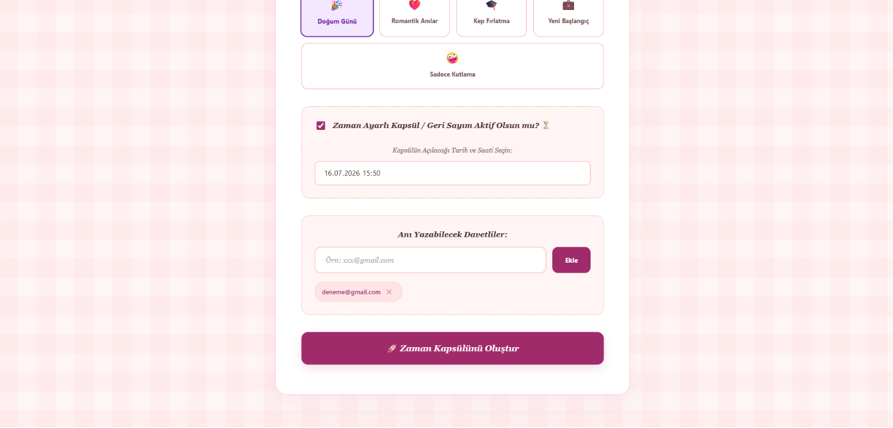
</p>

---

## 🔑 BÖLÜM II: GÜVENLİ GEÇİŞ & BAŞROL DENEYİMİ (Kutlanan Kişi)

### 1) Güvenli Geçiş Kapısı (Google Login)
Sihirli linke tıklayan davetli veya başrol, şifrelerle uğraşmadan **Google Sign-In** entegrasyonu sayesinde oda koduyla tek tıkla şifresiz, kodsuz anında sisteme giriş yapar.
<p align="center">
  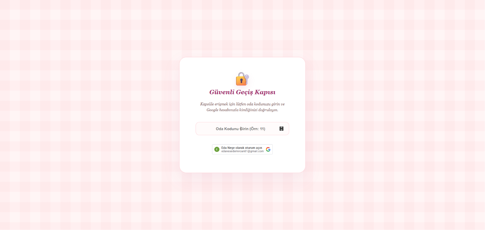
</p>

### 2) Geri Sayım Ekranı (Sayaç Sayfası)
Eğer kapsül zaman ayarlı ise, kutlanan kişi zamanı gelmeden önce odaya erişmek istediğinde karşısına tatlı bir geri sayım sayacı çıkar.
<p align="center">
  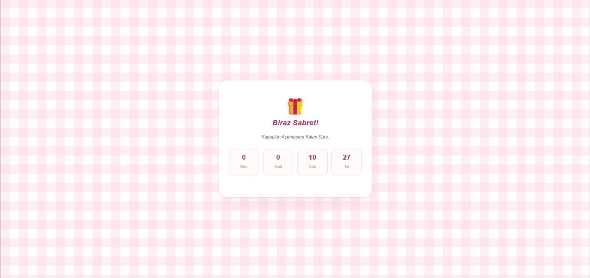
</p>

### 3) Büyük Buluşma (Kapsül Açılış Ekranı)
Sayaç sıfırlandığı an kutlanan kişi için heyecan dolu "Kapsülü Aç ve Keşfet!" butonu aktifleşir.
<p align="center">
  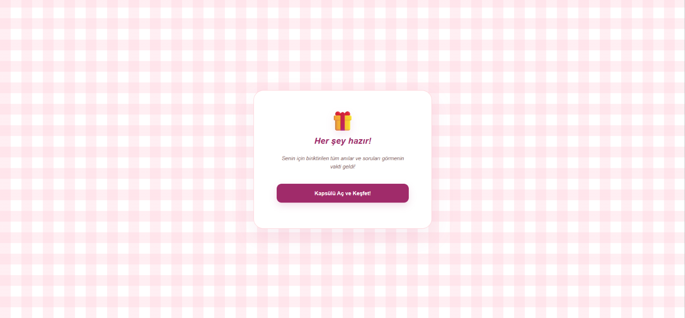
</p>

### 4) Anı Duvarı ve Panoyu Keşfetme
Butona tıklandığında, arkadaşlarının hazırladığı o muhteşem anı kartları ve anonim sürpriz sorular dinamik dalga geçişli asil bir arayüzle başrolün önüne serilir.
<p align="center">
  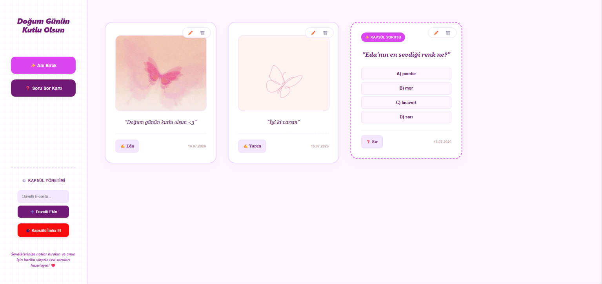
</p>

---

## 🤫 BÖLÜM III: DAVETLİ DENEYİMİ (Not & Soru Bırakanlar)

### 5) Davetli Yönetim ve Pano Sayfası
Davetlilerin sol paneldeki butonlar aracılığıyla kolayca anı ve soru ekleyebileceği, davetli listesini yönetebileceği ve şu ana kadar yazılmış tüm anı ve soruları görebileceği panel alanı.
<p align="center">
  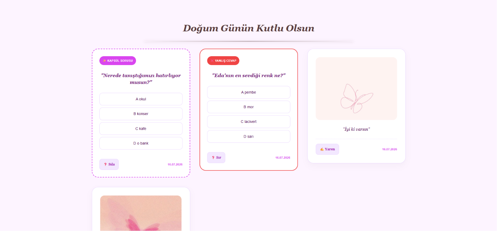
</p>

### 6) Anı Ekleme Modalı (Wall Post-it)
"Anı Bırak" butonuna tıklandığında açılan, davetlinin adını yazıp anısını dökebileceği ve fotoğraf iliştirebileceği pop-up penceresi.
<p align="center">
  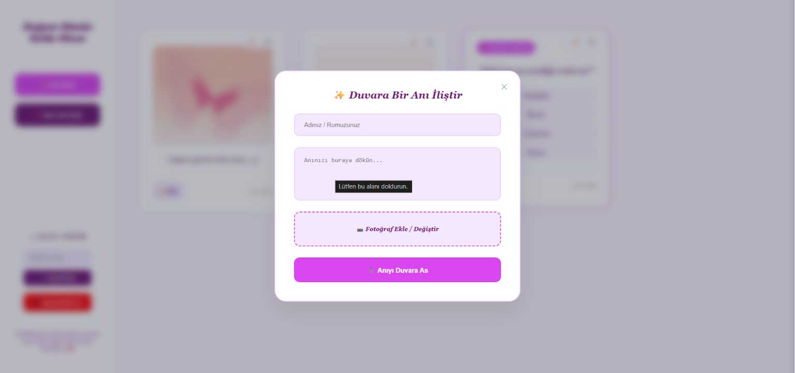
</p>

### 7) Soru Hazırlama Ekranı (Quiz Creator)
Davetlilerin kutlanan kişiye özel, şakalı ve çoktan seçmeli anonim sürpriz sorular hazırlayabileceği sağ panel arayüzü.
<p align="center">
  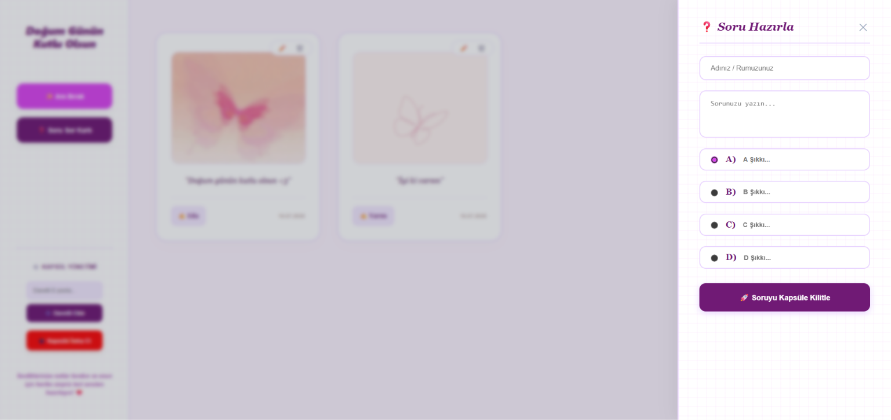
</p>

### 8) Cevaplama Modalı (Interactive Quiz Solver)
Kutlanan kişinin anonim soruları çözmeye çalıştığı interaktif alan. Yanlış cevap verdiğinde tatlı bir titreme (`shake`) efektiyle doğru cevaba yönlendirilir. Doğru bilindiğinde ise maske düşer ve soruyu soran kişinin ismi coşkulu bir animasyonla açığa çıkar!
<p align="center">
  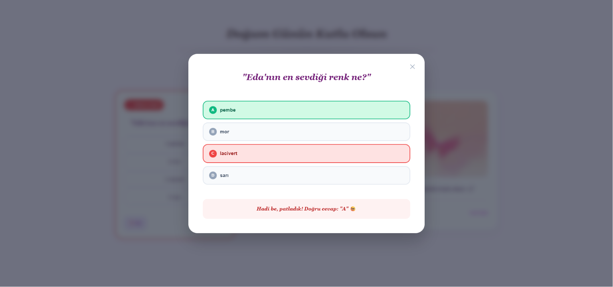
</p>

---

## 🛠️ Teknolojik Altyapı & Mimari

Proje, modern yazılım prensiplerine uygun olarak **Frontend** (Client) ve **Backend** (API) olmak üzere iki ana katmandan oluşmaktadır:

### 💻 Client (Önyüz)
* **Framework:** React 18
* **Programlama Dili:** TypeScript
* **Routing:** React Router DOM
* **Tasarım Yaklaşımı:** Tamamen responsive inline-CSS mimarisi, dinamik SVG dalga çizgi geçişleri (`Wave Divider`) ve kullanıcı dostu geçiş efektleri.

### ⚙️ Server (Arkayüz)
* **Framework:** .NET 8 / ASP.NET Core Web API
* **Programlama Dili:** C#
* **Veritabanı:** PostgreSQL / MS SQL
* **ORM:** Entity Framework (EF) Core

---

## 🚀 Kurulum ve Çalıştırma

### 1. Projeyi Klonlayın
```bash
git clone [https://github.com/kullanici-adi/surprise-wall.git](https://github.com/kullanici-adi/surprise-wall.git)
cd surprise-wall bunu yapıştırıyorum başka bir şeye gerek var mı
